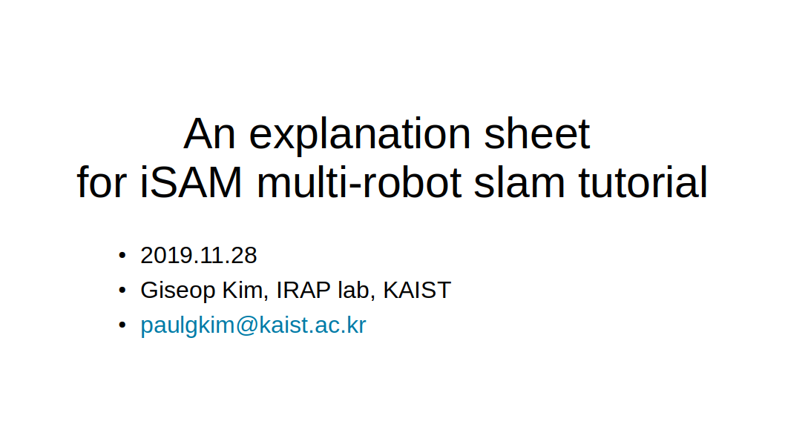
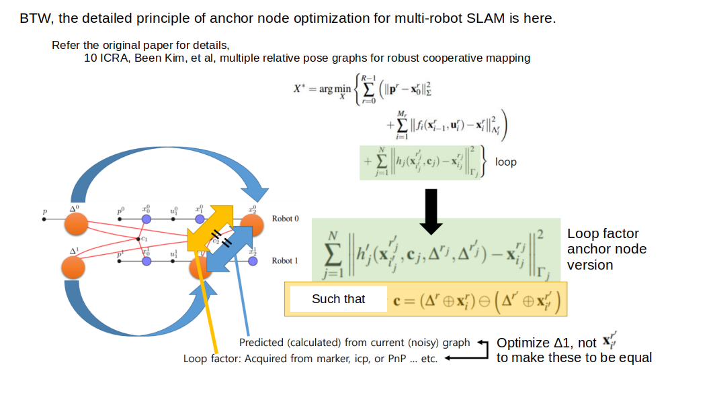
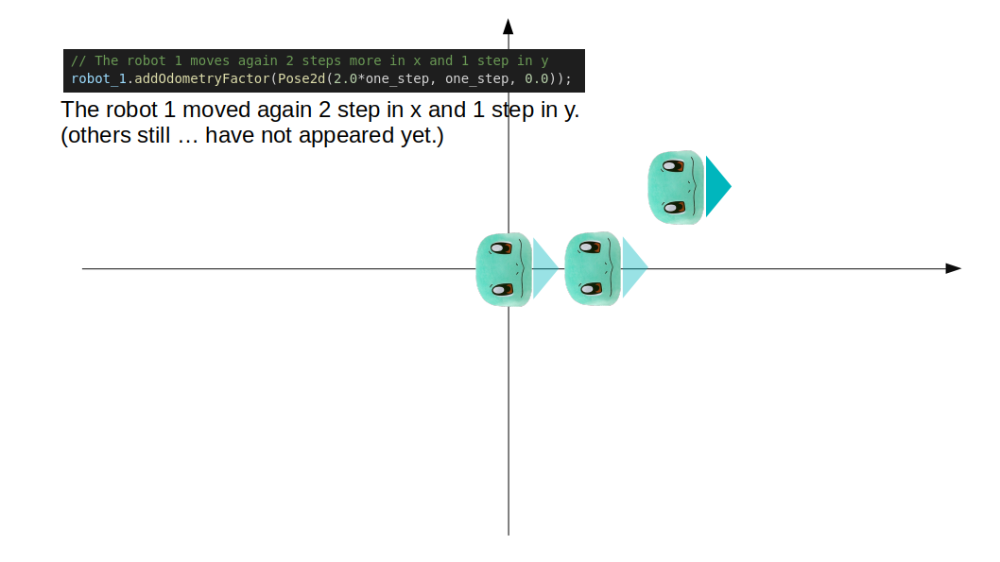
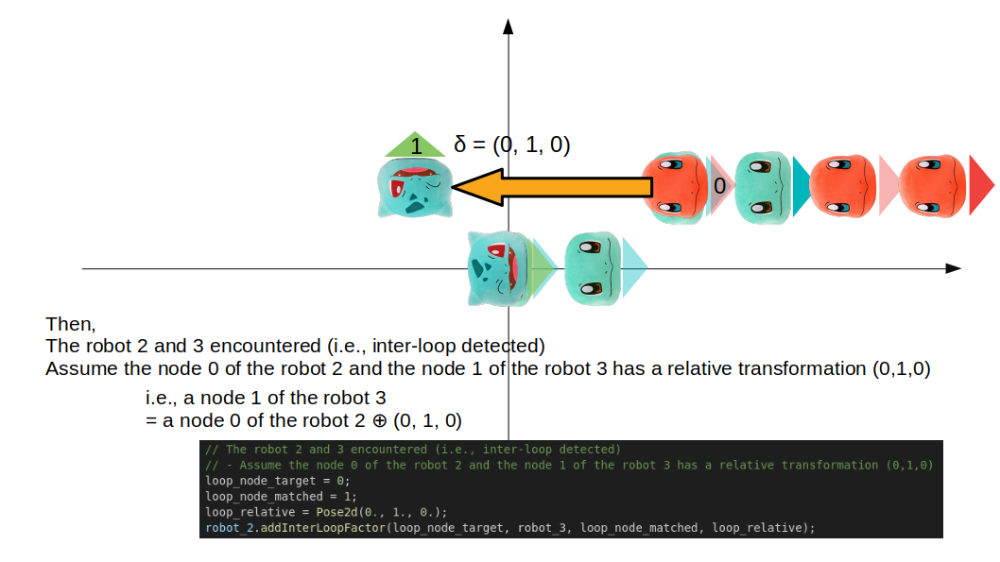
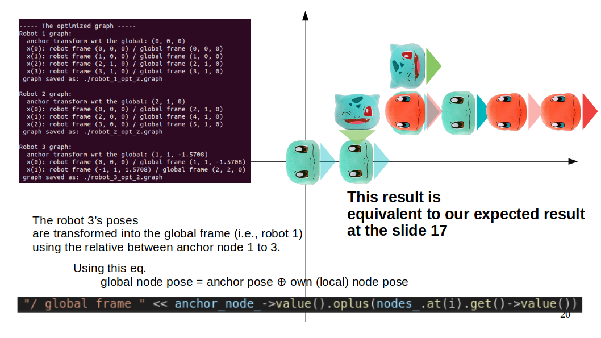

# Multi-robot SLAM using iSAM 

- ### <a href="https://github.com/ori-drs/isam/blob/master/examples/anchorNodes.cpp" target="_blank">iSAM anchor node</a>-based multiple robot (pose graph) SLAM tutorial codes with docs.


- Just run 
```
$ ./do_build.sh 
```


## About the tutorial 

- <a href="./docs/multirobot.pdf" target="_blank">Please refer the details here: Tutorial visual expalnations (PDF)</a>.
- Details are implemented in <a href="./utils/robot2d.h" target="_blank">robot2d.h</a> and <a href="./utils/robot2d.cpp" target="_blank">robot2d.cpp</a>

## Advantages of anchor node-based multi-robot SLAM
- This submap-like technique reduces time for convergence
- Each robot could be added at arbitrary time
- Each robot can operate on its own frame
- No gauge freedom problem (i.e., each robot has its own prior / if not, graph
convergence is not stable)
- Directly can be extend to the multi-session (or long-term) SLAM

## Further reading material
- (KOR) <a href="https://www.dropbox.com/s/c8x6r7xdqmcx7j8/20191122%20robust%20backend%20and%20multi%20session%20slam.pdf?dl=0" target="_blank">More detailed in-depth paper seminar material</a>

## Some example sheets from the docs

</a>
</a>
</a>
</a>
</a>

## contact 
- paulgkim@kaist.ac.kr

